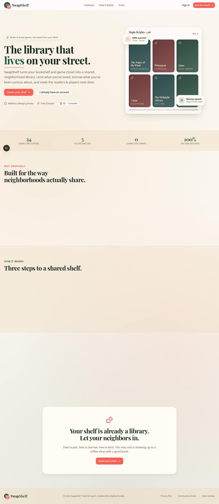

# SwapShelf

> **The library that lives on your street.** SwapShelf turns your bookshelf and
> game closet into a shared neighborhood library — lend what you've loved, borrow
> what you've been curious about, and meet the readers and players next door.



---

## Table of contents

- [Overview](#overview)
- [Architecture](#architecture)
- [Core systems](#core-systems)
- [Tech stack](#tech-stack)
- [Getting started](#getting-started)
- [Scripts](#scripts)
- [Project layout](#project-layout)
- [API reference](#api-reference)
- [Deployment](#deployment)
- [Testing](#testing)

---

## Overview

SwapShelf is a hyper-local, privacy-first lending marketplace for physical books
and board games. Unlike global marketplaces, it deliberately constrains scope to
a walkable radius and hides exact addresses, so trust is built between real
neighbors rather than anonymous accounts.

Key product differentiators:

| Capability | How it works |
| --- | --- |
| **Scan to shelve** | Barcode capture → Open Library / BoardGameGeek enrichment (cover, creator, edition). |
| **Hyper-local discovery** | Haversine-filtered discovery within a 1–5 mi radius; addresses never stored in the API response. |
| **Fuzzy location** | Exact coordinates are reduced to a coarse `"0.4 mi away"` string — privacy by design. |
| **Built-in coordination** | Every loan opens a private chat with a pinned meetup widget for a safe, public hand-off. |
| **Double-blind trust** | Reviews stay sealed until **both** parties submit, eliminating retaliation bias. |
| **Gamified reputation** | A weighted **SwapScore** (0–100) and trust tiers (Newcomer → Friendly → Trusted → Caretaker). |

---

## Architecture

SwapShelf is a **single Next.js 16 application** using the App Router for both
the rendered UI and the JSON API. There is no separate backend service — route
handlers under `src/app/api/**` are the server.

```
┌─────────────────────────┐     ┌──────────────────────────┐
│  Client (React + Zustand)│────▶│  Next.js Route Handlers   │
│  app/views/*, store/*    │◀────│  app/api/** (REST JSON)   │
└─────────────────────────┘     └──────────────────────────┘
                                         │
                                         ▼
                                 ┌────────────────┐
                                 │  Prisma Client  │
                                 └────────┬───────┘
                                          ▼
                                 ┌────────────────┐
                                  │  PostgreSQL     │
                                  │ (Neon)          │
                                 └────────────────┘
```

### Request lifecycle

1. **Session resolution** — `src/lib/auth.ts` resolves a token from three
   transports (authorization header, `x-session-token`, or the
   `swapshelf_session` cookie). The token is a DB-backed `sessionToken` on the
   `User` row.
2. **Proxy** — `src/proxy.ts` guards authenticated routes and applies
   rate-limiting policies before handler execution.
3. **Handlers** — each route uses `withErrorHandler` + a Zod `safeParse` of the
   body, then talks to Prisma inside a transaction where consistency matters
   (e.g. review reveal + score recompute).
4. **Serialization** — `src/lib/serialize.ts` strips server-only fields
   (`passwordHash`, `sessionToken`) before JSON leaves the boundary.

---

## Core systems

### 1. Auth & sessions (`src/lib/auth.ts`)

- Hybrid auth: bearer token (preview panels / API clients) **and** same-origin
  cookie fallback.
- Passwords hashed with `bcryptjs`; sessions are opaque random tokens stored on
  the `User` row (no JWT, revocable by nulling `sessionToken`).
- `requireUser()` throws a typed `401` consumed by `withErrorHandler`.

### 2. Loan state machine (`src/app/api/loans/[id]`)

A borrow progresses through an explicit status enum
(`ACCEPTED → MEETING_SCHEDULED → BORROWED → DUE_SOON → RETURNED/RESOLVED`,
with `OVERDUE`/`DISPUTED`/`STOLEN` as exception states). Sub-routes own the
transitions:

- `meetup/` — propose/confirm a public meetup spot.
- `messages/` — loan-scoped private chat.
- `verify-return/` — lender confirms the item came back.
- `report-stolen/` — escalates to `STOLEN` and notifies admin.

### 3. SwapScore engine (`src/lib/swap-score.ts`)

A deterministic, auditable reputation score (0–100):

```
score =
    reviewComponent   (avgRating / 5) * 50          # up to 50
  + volumeComponent   min(completedSwaps * 3, 30)    # up to 30
  + reliabilityComponent  clamp(onTime*2 - late*3, 0, 20)   # up to 20
```

Recomputed transactionally whenever a review is revealed or a loan closes.
Drives the trust tier shown on profiles and the landing badge.

### 4. Geo & fuzzy distance (`src/lib/geo.ts`)

- `haversineMiles()` filters discovery server-side.
- `fuzzyDistance()` rounds to 0.1 mi under 5 mi, whole miles beyond — the only
  location signal ever sent to clients.

### 5. Client state (`src/store/app-store.ts`)

A single Zustand store owns auth, navigation (`view`), cached data
(`myItems`, `loans`, `discoverItems`), filters, and **centralized modal state**
(`SCANNER | REVIEW | MEETUP | EXTENSION`) keyed by `modalContextId` — avoiding
scattered booleans. `bootstrap()` hydrates the session on first paint.

### 6. Design system (`src/app/globals.css` + `tailwind.config.ts`)

- OKLCH theme tokens with a full dark mode; a warm "paper" aesthetic
  (`paper-texture` gradient) reinforced by a forest-green primary / terracotta
  accent pairing.
- `ItemCover` renders a deterministic gradient "spine" per title as an LQIP,
  layering `next/image` on top with graceful `onError` fallback.

---

## Tech stack

| Layer | Choice |
| --- | --- |
| Framework | Next.js 16 (App Router, Turbopack) |
| Language | TypeScript (strict) |
| Styling | Tailwind CSS + shadcn/ui (Radix) + `tailwindcss-animate` |
| Data | Prisma ORM + PostgreSQL (Neon) |
| State | Zustand (client) + React Query (server cache) |
| Validation | Zod (`src/lib/validation.ts`) |
| Animation | Framer Motion |
| Auth | bcryptjs + DB-backed sessions |
| E2E | Playwright (Python) |

---

## Getting started

```bash
# 1. Install dependencies from the committed lockfile
npm ci

# 2. Generate the Prisma client and sync the schema
npm run db:generate
npm run db:push          # syncs the schema to PostgreSQL (Neon)

# 3. Run the dev server (port 3000, logs to dev.log)
npm run dev
```

Open <http://localhost:3000> and sign up. To populate realistic demo data for
the signed-in account (neighbors, items, loans, a revealed review):

```bash
curl -X POST http://localhost:3000/api/seed \
  -H "Content-Type: application/json" \
  -b "swapshelf_session=<your-session-cookie>"
```

The landing page reads live `/api/stats` and `/api/testimonial`, falling back to
curated values when the database is empty so the page never looks dead.

---

## Scripts

| Command | Description |
| --- | --- |
| `npm run dev` | Dev server on :3000 (Turbopack), tees to `dev.log` |
| `npm run build` | Production build → standalone output under `.next/standalone` |
| `npm run start` | Serve the standalone build (prod) |
| `npm run lint` | ESLint |
| `npm run test` | Jest suite (`NODE_ENV=test`) |
| `npm run db:generate` | Regenerate Prisma client |
| `npm run db:push` | Sync schema to PostgreSQL (Neon) |

---

## Project layout

```
swapshelf/
├── src/
│   ├── proxy.ts                  # route guard + rate limiting
│   ├── app/                      # App Router: pages + API route handlers
│   │   ├── page.tsx             # landing page (root route)
│   │   ├── globals.css          # OKLCH theme tokens + paper-texture
│   │   └── api/
│   │       ├── auth/            # login, logout, signup, me
│   │       ├── items/           # item CRUD + discover (geo-filtered)
│   │       ├── loans/
│   │       │   └── [id]/        # meetup, messages, verify-return,
│   │       │                    #   report-stolen  (state machine)
│   │       ├── reviews/         # double-blind review submission
│   │       ├── barcode/         # ISBN / barcode lookup
│   │       ├── users/           # profiles, location
│   │       ├── admin/           # disputes, admin messages, resolve
│   │       ├── cron/            # scheduled jobs (zombie loan cleanup)
│   │       └── stats · testimonial · seed · metrics · notifications
│   ├── components/
│   │   ├── ui/                  # shadcn/ui primitives
│   │   ├── shared/              # Logo, ItemCover, SwapScore, AppShell
│   │   └── views/               # Landing, Dashboard, Discover, Loan,
│   │                            #   Profile, Auth, Onboarding, Admin
│   ├── hooks/                   # use-chat, use-mobile, use-toast, …
│   ├── lib/                     # auth, db, geo, swap-score, serialize,
│   │                            #   validation, rate-limit, logger, api
│   │   └── types.ts             # shared domain types
│   └── store/                   # Zustand client state
├── prisma/                      # schema (synced via `prisma db push`)
├── public/                      # static assets (logo, landing-preview.png)
├── tests/                       # Jest test suite
├── mini-services/               # standalone helper services
├── scripts/                     # build / ops scripts
├── deploy/                      # deployment configs (Docker, Caddy)
└── db/ · download/ · examples/  # local db / sample data / misc
```

---

## API reference

All endpoints are JSON. Authenticated routes require a session token (cookie or
`Authorization: Bearer`). Errors return `{ "error": "..." }` with a typed status.

| Method | Path | Purpose |
| --- | --- | --- |
| `POST` | `/api/auth/signup` | Create account + start session |
| `POST` | `/api/auth/login` | Authenticate |
| `POST` | `/api/auth/logout` | Revoke `sessionToken` |
| `GET` | `/api/auth/me` | Current user |
| `GET` | `/api/items/discover` | Geo-filtered nearby items |
| `POST` | `/api/items` | Add an item (scan or manual) |
| `POST` | `/api/loans` | Request a borrow |
| `POST` | `/api/loans/[id]/verify-return` | Lender confirms return |
| `POST` | `/api/reviews` | Submit a review (reveals both when paired) |
| `GET` | `/api/barcode/lookup` | Enrich a scanned barcode |
| `GET` | `/api/stats` | Public platform metrics (landing) |
| `GET` | `/api/testimonial` | Featured revealed review (landing) |
| `POST` | `/api/seed` | Populate demo data for current user |
| `POST` | `/api/admin/resolve` | Admin dispute resolution |

---

## Deployment

### Vercel (recommended)

Vercel's filesystem is ephemeral and serverless functions are stateless, so the
database **must be externally hosted** — the schema targets **PostgreSQL**
(Neon), and the old local SQLite dev database has been removed.

1. **Provision a Postgres database** — Neon (used here), Vercel Postgres, or
   Supabase. Copy its connection string into the project's environment variables
   as `DATABASE_URL`. Neon's direct URL works with `?sslmode=require`; for
   serverless connection pooling use the pooled URL.
2. **Set required env vars** in Vercel (Project → Settings → Environment
   Variables): `DATABASE_URL`, `CRON_SECRET` (matches the one the cron route
   expects), and `NEXT_PUBLIC_SITE_URL`.
3. **Schema sync at build time** — the `build` script runs
   `prisma generate && prisma db push --accept-data-loss` before `next build`,
   so the schema is applied automatically on every deploy (no interactive
   `migrate dev`). Schema is kept in source via `prisma db push` rather than
   generated migration files, which avoids the Prisma migration engine's
   SSL/shadow-database friction with Neon.
4. **Daily cron** — `vercel.json` registers
   `GET /api/cron/auto-close-zombies?secret=$CRON_SECRET` on a `0 3 * * *`
   schedule, reusing the `CRON_SECRET` env var.
5. **Seed demo data** once after the first deploy (requires a logged-in user):
   ```bash
   curl -X POST https://<your-app>.vercel.app/api/seed \
     -H "Content-Type: application/json" \
     -b "swapshelf_session=<your-session-cookie>"
   ```

The Prisma client is a cached singleton in `src/lib/db.ts` to avoid exhausting
connections across Vercel's short-lived functions. SQLite-only pragmas are
skipped automatically when `DATABASE_URL` is not a `file:` URL.

> Note: `.env` points at the Neon database for both local dev and production.
> Vercel env vars override it in production. The old `prisma/prisma/dev.db`
> SQLite file and the local Docker Postgres container have been removed.

### Docker / self-hosted

A reference setup also ships in `deploy/`:

- `Dockerfile` + `docker-compose.yml` — containerized app + database.
- `Caddyfile` — TLS-terminating reverse proxy.
- `start-production.sh` — runs the standalone server.

```bash
docker compose up --build
```

Set `DATABASE_URL` and `CRON_SECRET` for prod.

---

## Testing

- **Unit/integration** — `npm run test` runs the Jest suite in `tests/`.
- **End-to-end** — Playwright drives the running app; used here to verify the
  landing page (console/page errors, section presence, screenshot capture) and
  to seed demo data through the real API.

---

## License

Built for warm, trustworthy neighborhoods. **Privacy first · Community-driven ·
Open shelves.**
